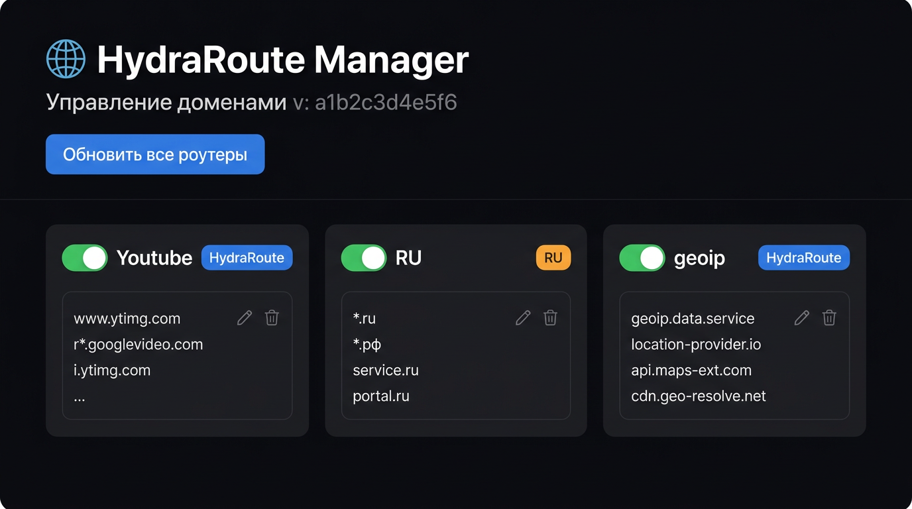

# HydraRoute Manager

Веб-панель для централизованного управления конфигурацией **HydraRoute Neo** на роутерах Keenetic. Редактируешь списки доменов и IP в браузере — одной кнопкой отправляешь на все роутеры.

> **Поддержать проект:** [Boosty](https://boosty.to/andrey27/donate) · [Ozon СБП](https://finance.ozon.ru/apps/sbp/ozonbankpay/019dc200-2a5d-7931-a619-782d285f6798) · Telegram: [@Iot_andrey](https://t.me/Iot_andrey)



---

## 1. Что это за проект

HydraRoute Neo — плагин для Keenetic, который маршрутизирует трафик по доменам и IP-адресам. Например: YouTube и Netflix — через VPN, всё остальное — напрямую. Конфигурация хранится в двух файлах на роутере: `domain.conf` и `ip.list`.

Проблема: редактировать эти файлы напрямую неудобно, а если роутеров несколько — приходится делать всё вручную на каждом.

**Этот проект решает проблему:** устанавливаешь сервис на VPS, редактируешь домены и IP через браузер, нажимаешь «Обновить все роутеры» — файлы сами разъезжаются по всем роутерам через SSH.

```
┌──────────────────────────────┐
│  Браузер → http://VPS:8000   │  ← ты работаешь здесь
└──────────────┬───────────────┘
               │
┌──────────────▼───────────────┐
│  HydraRoute Manager на VPS   │  ← этот сервис
└──────────┬──────────┬────────┘
           │ SSH      │ SSH
    ┌──────▼──┐  ┌────▼──────┐
    │Роутер 1 │  │ Роутер 2  │  ← конфиги обновляются автоматически
    └─────────┘  └───────────┘
```

**Что умеет:**
- Редактировать группы доменов и IP через браузер.
- Включать/выключать группы одним переключателем.
- Отправлять конфиг сразу на все роутеры одной кнопкой.
- Снимать конфиг с конкретного роутера и подставлять в редактор.
- Отправлять конфиг на один конкретный роутер.
- Проверять SSH-соединение с роутером.
- Для роутеров **без белого IP** — встроенный мастер настройки обратного туннеля.

**Требования:**
- Роутер Keenetic с установленным HydraRoute Neo и Entware.
- Белый IP на WAN роутера **или** настроенный обратный тоннель (см. раздел 3).

---

## 2. Быстрая установка

Вставляй команды на **VPS** (сервере), где будет работать панель.

### Шаг 1 — клонируй и запусти установщик

```bash
cd /opt
git clone https://github.com/andrey271192/domen_hydra.git /opt/domen-hydra
cd /opt/domen-hydra
sudo bash server/install.sh
```

Установщик создаст Python-окружение и зарегистрирует systemd-сервис `hydra-manager`.

> Если видишь `Unable to read current working directory` — сначала выполни `cd /opt`, потом повтори.

### Шаг 2 — задай пароли

```bash
nano /opt/domen-hydra/server/.env
```

Минимум что нужно поменять:

```
ADMIN_PASSWORD=твой-пароль-для-панели

# SSH-пароль роутера (если у всех одинаковый)
SSH_USER=root
SSH_PASS=keenetic
```

Если планируешь **туннель** (для роутеров без белого IP) — добавь сюда же:

```
VPS_SSH_HOST=IP_или_домен_твоего_VPS
```

### Шаг 3 — перезапусти сервис

```bash
sudo systemctl restart hydra-manager
```

### Шаг 4 — открой панель

```
http://IP_ТВОЕГО_VPS:8000
```

Введи пароль из `ADMIN_PASSWORD`.

### Обновление

```bash
cd /opt/domen-hydra && git pull && sudo systemctl restart hydra-manager
```

### Удаление

```bash
curl -fsSL https://raw.githubusercontent.com/andrey271192/domen_hydra/main/server/uninstall.sh | sudo bash
```

---

## 3. Туннель — для роутеров без белого IP

### Что такое «белый IP» и зачем он нужен

По умолчанию сервис подключается к роутеру по SSH напрямую. Для этого нужен **публичный IP** роутера — чтобы VPS мог до него «дотянуться».

Если провайдер выдаёт **серый IP** (роутер за NAT оператора — очень частая ситуация в России), VPS не может достучаться до роутера. Роутер сам должен инициировать соединение.

### Как работает туннель

Роутер сам открывает зашифрованное SSH-соединение на VPS и говорит: «слушай у себя порт 20100 — всё что придёт туда, перешли мне на порт 22 (SSH)».

```
Роутер (серый IP)  ──SSH──▶  VPS :20100
                                 │
VPS → hydra-manager ────────────▶│──▶ SSH роутера (порт 22)
```

В итоге сервис подключается к роутеру через `localhost:20100`, а не напрямую. Серый IP не мешает. Кнопки «Обновить все роутеры» и «На роутер» работают через тоннель автоматически.

### Что понадобится

- Публичный IP/домен VPS (уже есть).
- Роутер с установленным **Entware** (нужен для `autossh`).

### Установка Entware на роутер

> Entware — пакетный менеджер для роутеров, позволяет устанавливать дополнительные программы.

С KeeneticOS 4.2+ — прямо через браузер: открой `192.168.1.1/a` и следуй инструкциям.

Или через SSH на роутере (логин `root`, пароль `keenetic`, порт 22):

```sh
# MT7628/MT7621 → mipsel:
opkg disk storage:/ https://bin.entware.net/mipselsf-k3.4/installer/mipsel-installer.tar.gz

# MT7622/MT7981/MT7988 (ARM) → aarch64:
opkg disk storage:/ https://bin.entware.net/aarch64-k3.10/installer/aarch64-installer.tar.gz
```

Дождись окончания (~2 минуты), проверь: `opkg update` должен отработать без ошибок.

### Шаг 1 — настрой .env на VPS

```bash
nano /opt/domen-hydra/server/.env
```

Добавь или заполни:

```
VPS_SSH_HOST=IP_или_домен_VPS    # публичный адрес, куда роутер будет коннектиться
VPS_SSH_PORT=22                   # SSH-порт VPS (обычно 22)
VPS_SSH_USER=root                 # пользователь VPS
```

`VPS_SSH_PASS` не нужен — туннель работает через SSH-ключи, которые генерируются автоматически.

Перезапусти:

```bash
sudo systemctl restart hydra-manager
```

### Шаг 2 — добавь роутер в панель

Открой `http://VPS:8000` → вкладка «Роутеры».

**Вариант А** (роутер уже добавлен): нажми кнопку **«⇄»** напротив нужного роутера.

**Вариант Б** (роутер ещё не добавлен): введи имя и SSH-пароль роутера, нажми **«⇄ Тоннель»** вместо «+ Добавить» — роутер добавится и сразу откроется окно туннеля.

> Если кнопки «⇄ Тоннель» нет — проверь, что `VPS_SSH_HOST` в `.env` не пустой и сервис перезапущен.

### Шаг 3 — скопируй и выполни команду на роутере

В открывшемся окне появится одна команда вида:

```
curl -fsS 'http://VPS:8000/api/routers/andrey/tunnel-script?token=XXX' | sh
```

Нажми **«📋 Копировать»** (если не сработало — выдели текст и Cmd/Ctrl+C).

Зайди по SSH на **роутер** (не на VPS!) и вставь команду:

```
ssh root@192.168.1.1
```

> **Как отличить терминал роутера от VPS:**
> - Роутер: приглашение выглядит как `~ #` или `(none) ~ #`
> - VPS: выглядит как `root@имя-сервера:~#`

Скрипт автоматически:
1. Установит `autossh` через opkg.
2. Запишет SSH-ключ в `/opt/etc/hydra_tk`.
3. Создаст скрипт тоннеля `/opt/bin/hydra_tun`.
4. Пропишет автозапуск через Entware init.d.
5. Запустит тоннель в фоне.

В конце увидишь:

```
=== OK ===
Тоннель: localhost:22 (роутер) -> VPS:20100
```

### Шаг 4 — проверь связь

В браузере нажми **«⟳ Проверить связь»** — если всё хорошо, статус изменится на «✅ Активен».

После этого «Обновить все роутеры» и «📡 На роутер» будут работать через тоннель автоматически.

### Ручной запуск и диагностика

Если автоматический запуск не сработал (написало «ОШИБКА»):

```sh
# На роутере — запусти вручную (увидишь вывод):
/opt/bin/hydra_tun

# Проверить лог:
cat /tmp/hydra_tun.log

# Перезапустить через init.d:
killall autossh 2>/dev/null; sleep 1; /opt/etc/init.d/S99hydra_tun start
```

Если `/opt/bin/hydra_tun` работает вручную — попробуй перезагрузить роутер: при старте Entware сам запустит туннель.

### Проверка на VPS

```bash
ss -tlnp | grep 20100
# Должна быть строка с 127.0.0.1:20100 — значит туннель активен
```

---

## 4. Логины и пароли

Здесь два разных набора учётных данных. Не перепутай.

### Пароль веб-панели (`ADMIN_PASSWORD`)

Пароль для входа на `http://VPS:8000`. Задаётся в `server/.env`. Никак не связан с роутерами.

### SSH-пароль роутера (`SSH_PASS`)

Это пароль для входа по SSH на роутер (`root` / `keenetic` по умолчанию). Нужен сервису, чтобы отправлять конфиги через SSH.

- **Общий для всех** — задаётся в `server/.env`: `SSH_PASS=keenetic`
- **Индивидуальный** — поле «SSH пароль» при добавлении роутера в панели (перекрывает глобальный).

> Поле **IP** — это адрес для SSH (LAN-адрес, белый IP или DDNS), **не** веб-ссылка KeenDNS. Если случайно вставил URL вроде `https://...` — сервис автоматически извлечёт из него хост.

### SSH-ключи для туннеля

Ничего делать не нужно — ключи генерируются на VPS автоматически при нажатии «⇄». Приватный ключ уходит на роутер через одноразовую ссылку (действует 10 минут). Пароль SSH для туннеля не используется.

---

## 5. Как добавлять домены и IP

### Вкладка «Конфигурация»

Здесь карточки с группами доменов и IP. Каждая группа имеет:
- **Имя** — например `youtube` или `ru-geoip`.
- **Политику** — `HydraRoute` (через VPN), `RU` (локально), `Google` и т.д.
- **Список записей** — домены или IP/CIDR, по одному на строку.

Нажми **«✏️»** на карточке → редактируй → **«💾 Сохранить»**.

### Вкладка «Импорт файлов»

На вкладке «Роутеры» нажми **«⬇ С роутера»** — файлы подтянутся автоматически и подставятся в поля импорта. Или вручную скопируй с роутера:

```sh
cat /opt/etc/HydraRoute/domain.conf
cat /opt/etc/HydraRoute/ip.list
```

### Формат domain.conf

```
##youtube
youtube.com,youtu.be,googlevideo.com/HydraRoute

##avito
avito.ru,ozon.ru/RU
```

### Формат ip.list

```
##geoip:ru
/RU
geoip:ru
```

### Отправка на роутеры

- **«📡 Обновить все роутеры»** — отправляет конфиг на все роутеры и делает `neo restart`.
- **«📡 На роутер»** на карточке роутера — только на один конкретный.

### Установка cron-обновления на роутер

```bash
export SERVER_URL="http://IP_ТВОЕГО_VPS:8000" \
  && curl -fsSL https://raw.githubusercontent.com/andrey271192/domen_hydra/main/install_router.sh | sh
```

Ручное обновление прямо на роутере:

```sh
sh /opt/bin/hydra_update.sh
```

---

## 6. Частые ошибки и решения

### `Unit hydra-manager.service not found`

**Причина:** `server/install.sh` не дошёл до конца.

**Решение:**
```bash
cd /opt && sudo bash /opt/domen-hydra/server/install.sh
```

### `нет IP и нет тоннеля` при обновлении роутеров

**Причина:** Роутер добавлен без IP и без настроенного туннеля.

**Решение:** Укажи IP роутера или настрой туннель (кнопка «⇄» напротив роутера).

### Туннель пишет «autossh не запустился в фоне»

```sh
# Проверь вручную на роутере:
/opt/bin/hydra_tun
# Если работает — перезагрузи роутер. Если нет — смотри лог:
cat /tmp/hydra_tun.log
```

### `neo restart` завершается с ошибкой

**Причина:** HydraRoute Neo не установлен. Проверь: `opkg list-installed | grep hydraroute`.

### Панель не открывается (`http://VPS:8000`)

```bash
sudo ufw allow 8000/tcp
```

### Кнопка «📋 Копировать» не срабатывает

Встроен fallback — текст выделяется автоматически. Нажми Cmd+C (Mac) или Ctrl+C (Windows/Linux).

---

## 7. Полезные советы

**Как зайти на роутер по SSH:**
```
Адрес: 192.168.1.1   Логин: root   Пароль: keenetic   Порт: 22
```

**Управление сервисом на VPS:**
```bash
sudo systemctl status hydra-manager
sudo systemctl restart hydra-manager
sudo journalctl -u hydra-manager -n 50
```

**Проверить активные туннели:**
```bash
ss -tlnp | grep 2010
```

**Прямые ссылки для роутера:**
```
http://VPS:8000/hydra/domain.conf
http://VPS:8000/hydra/ip.list
http://VPS:8000/hydra/version
```

---

## Связанные проекты

- [keenetic-dns-routes](https://github.com/andrey271192/keenetic-dns-routes) — встроенная DNS-маршрутизация без Neo
- [keenetic-unified](https://github.com/andrey271192/keenetic-unified) — Neo + дашборд + мониторинг
- [Keenetic SSH](https://github.com/andrey271192/Keenetic_SSH) — прямой SSH (нужен белый IP)
